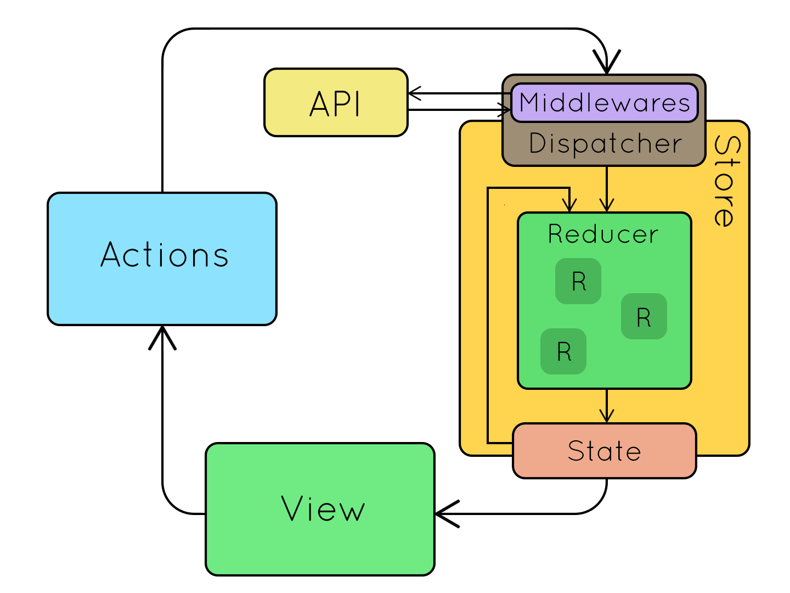

# Redux + Thunk

## The WWWWW&H for Thunks

### Who?

-   **Who** uses thunks?

    -   You!

-   **What** is a thunk?

    -   Besides being a fun way to make your English teacher super mad, a thunk is...

        `A subroutine used to inject an additional calculation into another subroutine. Thunks are primarily used to delay a calculation until its result is needed, or to insert operations at the beginning or end of the other subroutine.`

    -   In non-brainmelting terms...

        `A subprocess that runs and either waits to give its result when it's good and ready, or a subprocess that inserts itself into an already established process.`

    -   In terms of Redux...

        `A way for us to inject an async process into the Redux flow so it can eventually update our Redux store.`

-   **When** should I use a thunk?

    -   The usual case is going to be when you need to make a fetch to some API, be it your own backend, or some 3rd party. Remember Express, we're about to add all that knowledge back in!

-   **Where** does a thunk occur in the Redux flow?

    -   Great question! Let's take a look at the old flow.
        

        1. The user has an `interaction` with our Application
        2. That `interaction` sends an `action`, which as a `type` and `payload`, to the `Dispatcher`
        3. The `Dispatcher` sends `action` to the `Reducer`
        4. The `Reducer` takes the in the current `state` and `action`. It looks at all of its switch cases to see if the `action`'s `type` has a match.
            - If a match is found the it follows case of what to do with the `action`'s `payload` and/or current `state`
            - If not, it's best practice to return the current `state`

    -   So where do thunks come in?
        

        1. The user has an `interaction` with our Application
        2. That `interaction` sends an `ThunkActionCreator`, which is a function (more on this in a bit), to the `Dispatcher`.

        3. **The `Thunk Middleware` realizes that this is a function and NOT an action. It will then run the funciton and when it's good and ready, it will dispatch an actual `action.`**

        4. The `Dispatcher` sends `action` to the `Reducer`
        5. The `Reducer` takes the in the current `state` and `action`. It looks at all of its switch cases to see if the `action`'s `type` has a match.
            - If a match is found the it follows case of what to do with the `action`'s `payload` and/or current `state`
            - If not, it's best practice to return the current `state`

-   **WHY?????**

    -   It just seems like we're adding an extra step into something that's already complex. Can't I just make my fetch calls in my component and then when that call is done I can update my redux store?

        ***

        `While it's possible to make these API calls from your components and dispatch synchronously on success, for consistency and reusability it's preferable to have the source of every change to our application state be an action creator. Thunks are a new kind of action creator that will allow you to do that.` [a/A Open](https://open.appacademy.io/learn/js-py---sep-2020-online/week-15-sep-2020-online/thunk-actions)

        ***

        `In React / Redux, thunks enable us to avoid directly causing side effects in our actions, action creators, or components. Instead, anything impure will be wrapped in a thunk. Later, that thunk will be invoked by middleware to actually cause the effect. By transferring our side effects to running at a single point of the Redux loop (at the middleware level), the rest of our app stays relatively pure. Pure functions and components are easier to reason about, test, maintain, extend, and reuse.`
        [Medium Article](https://medium.com/fullstack-academy/thunks-in-redux-the-basics-85e538a3fe60#:~:text=Thunks%20in%20React%20%26%20Redux,be%20wrapped%20in%20a%20thunk.)

-   **HOW?**
    Let's DO THIS! Let's take a look at the App first, just to see what it does, and such and so forth.

    1.  Let's install the 'redux-thunk' middleware.

        -   It basically looks like this.

            ```js
            const thunk = ({ dispatch, getState }) => (next) => (action) => {
                if (typeof action === 'function') {
                    return action(dispatch, getState);
                }
                return next(action);
            };
            ```

    2.  Let's import redux-thunk into our store
    3.  Now we need to add this middleware to our applyMiddleware()
    4.  Let's go to store/card.js and let's define a ThunkActionCreator.
        -   For now, let's just have it console.log('Hello from Thunk')
    5.  Head on over to App.js and let's change the import from the Action Creator to the ThunkActionCreator that we just made.
    6.  This means that we'll have to remove it from our dispatch.
    7.  Let's clean up the file.
    8.  Let's test it here to see if our console.log shows up.
    9.  Let's start write the Thunk Action Creator.

        -   A Thunk/Action Creator is a funciton that intakes params used at invocation, that then returns another function that intakes dispatch. It should eventually dispatch an action (POJO).

            ```js
            const thunkAction = (param1, param2) => async (dispatch) => {
                const res = await fetch('api/something');
                const { thing } = await res.json();
                dispatch(definedAction(thing));
            };
            ```
